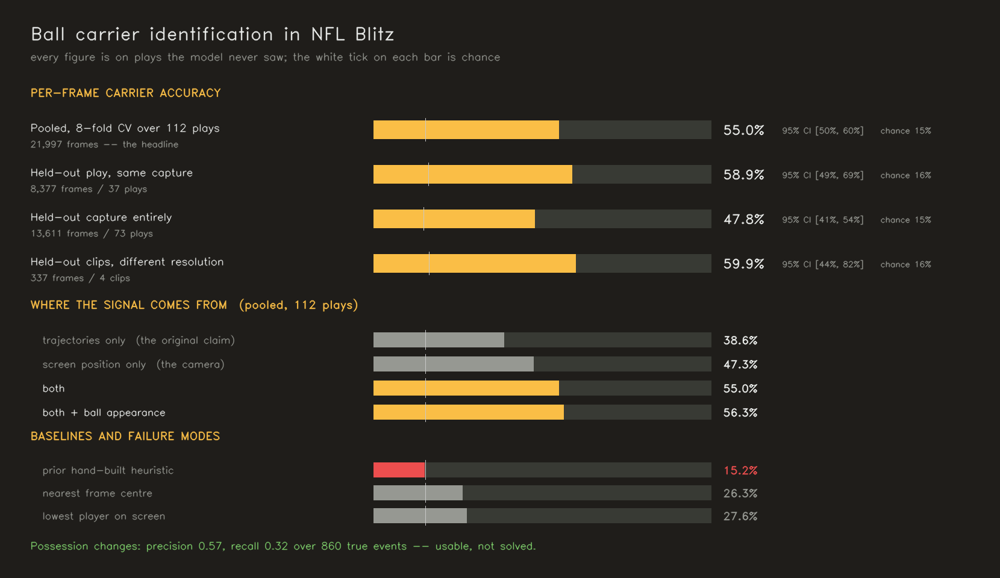

# ballcarrier

Identifying which player is carrying the ball, frame by frame, in NFL Blitz
gameplay video — and measuring, honestly, how far that gets you.

## Answer

**Partly.** On plays it has never seen, the model names the correct ball
carrier on **55.6%** of live-play frames (95% CI [0.50, 0.61]) against a 15.4%
chance rate — about 3.6× chance, measured over **21,997 frames across 112
plays**.

**Possession changes now work well enough to be worth reporting.** Precision
**0.57** at recall 0.32 over **860** true events. In the previous iteration
this was precision 0.17 over 4 events, which was not a measurement so much as
a rounding artefact.

The project's founding claim — that possession is recoverable from
trajectories alone — is **still not supported**. Trajectory features reach
34.9%; features describing only where the camera has put a player on screen
reach 47.3%. The camera follows the ball, and framing carries more of the
answer than the motion does.



## Read the accuracy number carefully

An earlier version of this README reported **72.6%**, and that figure was worse
than this one despite being larger. It was measured on four short clips — 344
frames, three of which trained the model that scored the fourth — with a
confidence interval of [0.63, 0.86]. The number here rests on 112 independent
plays from two 18-minute captures, and its interval is ±5 points.

Accuracy on a small, homogeneous test set is not comparable to accuracy on a
large, varied one. The honest summary is that the earlier number was never
that good; we just could not see how uncertain it was.

## How the labels exist at all

NFL Blitz draws a blue ellipse on the turf beneath the player under user
control. `src/hud.py` finds it, which yields a carrier label on every frame,
automatically, for as much footage as we record. That is what makes the
question answerable at this scale.

**The reticle is an answer key, not a model input.** The model never sees it.
It supervises training and scores predictions, nothing more — a model allowed
to see it would be perfectly accurate and would have learned nothing, and real
broadcast football has no reticle at all.

The label is a proxy: it marks the *controlled* player. It equals the ball
carrier during offensive live play — verified by drawing 36 uniformly random
labelled frames at native resolution and inspecting each one — and it does not
equal the carrier before the snap, after the whistle, or on defensive
possessions. The first two are excluded by `evaluate.play_mask`. **The third is
untested: all footage here is offensive possession**, so we cannot say whether
the model has learned "who has the ball" or "who is the human playing."

### Detector defects found by looking at frames, not metrics

Every one produced confident output, and none was visible in any number:

| symptom | cause |
|---|---|
| carrier jumps mid-play | the blue **line of scrimmage** painted on the turf crosses every player's feet, satisfying the "at a player's feet" anchor |
| carrier jumps to the corner | the **TURBO bar**, whenever a player ran in front of it |
| static-HUD suppression never fired | threshold 0.60 against a frame maximum of **0.592** — the mask was always empty and the filter was inert from the day it was written |
| tackled carriers lost their label | detection at `conf=0.35/imgsz=960` missed players in a pile, exactly when possession is most in doubt |
| label on the wrong player | reticle→track assignment accepted any box horizontally containing the reticle, then minimised vertical distance alone. With the reticle between two players, a small distant box could beat the large near one. Fixed; corrected 213 labels in the 2012 cache and 22 across the clips |
| 0.8% hit rate on a new capture | that source renders the indicator as a blue-and-yellow **checkered ring**, which the colour mask shatters into crescents |

## Where the numbers apply

A frame is scored only if the field is on camera, players are in motion, a
label exists, and at least three players are tracked. `dataset.scored_mask`
applies that identically to every method, so accuracies are comparable.

Possession changes are defined **spatially** — the indicator jumps more than a
player's width to a *different* tracked player — never as "the label's track id
changed". Trackers reassign ids constantly and each would count as a turnover.

## Results

| source | frames | plays | role |
|---|---|---|---|
| 1997 arcade, two 18-min captures | 22,722 scored | 112 | development + evaluation |
| 1997 arcade, four short clips | 344 scored | 4 | small held-out set |
| 2012 XBLA re-release, 163s | 3,787 scored | 12 | earlier development source |

Only 14–22% of the long captures yield labels: much of each is attract-mode
demo play, where no one is in control and no indicator is drawn.

### Per-frame accuracy, 8-fold grouped CV over 112 plays

| method | accuracy | vs chance (0.154) |
|---|---|---|
| trajectories only | 0.349 | 2.3× |
| screen position only | 0.473 | 3.1× |
| both | 0.546 | 3.5× |
| **both + ball appearance** | **0.556** [0.50, 0.61] | **3.6×** |

### Baselines, on exactly the same 112 plays

| method | accuracy | vs chance |
|---|---|---|
| prior hand-built heuristic | 0.152 | 0.98× — at chance |
| fastest player | 0.179 | 1.15× |
| nearest frame centre | 0.263 | 1.69× |
| lowest player on screen | 0.275 | 1.77× |
| **learned model** | **0.556** | **3.60×** |

This is the first evaluation where the learned model decisively beats the
trivial rules. On the four short clips, "lowest player on screen" scored 0.581
and *beat* the cross-domain model — but on 112 plays it manages 0.275. The
baseline was winning on a small, homogeneous test set rather than on the task.

### The same model under harder splits

| split | test frames | accuracy | what it tells you |
|---|---|---|---|
| 8-fold CV, both captures pooled | 21,997 | **0.563** | the headline; tightest interval |
| leave-one-play-out within one capture | 8,377 | 0.589 | same capture, unseen play |
| train capture 1 → test capture 2 | 13,611 | 0.478 | a wholly unseen recording |
| train capture 1 → test the 4 clips | 337 | 0.608 | different resolution and frame rate |

Accuracy falls to 0.478 across two different captures of the same game. That
gap is the honest measure of how well this travels.

### Tracking stability

The carrier's track id changes on **8.7%** of frames where the carrier did not
change (1,906 of 21,786). Higher than the 3.7% measured on the 2012 footage,
and it puts a ceiling on how stable any identity this pipeline emits can be.

### Possession changes

| split | events | precision | recall |
|---|---|---|---|
| pooled, 112 plays | 860 | **0.567** | 0.305 |
| within one capture | 408 | 0.573 | 0.368 |
| across captures | 452 | 0.484 | 0.296 |

Usable, not solved. Roughly two in five announced changes are still false, and
two thirds of real ones are missed.

### Four ideas measured; two earned their place

Kept behind flags either way, because a deleted negative result gets
re-proposed.

- **Ball appearance** (`--` on by default). Scoring every candidate for a
  football in their hands, rather than only the player already chosen. It
  *cost* accuracy at 340 training frames (0.726 → 0.709) and *gains* it at
  22,000 (0.546 → 0.556). A feature can be worth having only once there is
  enough data to fit it.
- **Camera-motion correction** (`--no-camera` to disable). Velocities are
  measured in screen pixels, so a pan makes every player appear to accelerate.
  On the four clips it lifted trajectory-only accuracy 0.612 → 0.724, the
  largest single movement in the project. Pooled at scale it is neutral:
  0.556 against 0.561. Worth keeping for high-motion footage, not a general win.
- **Minimum dwell time** (`--dwell`). Raises change precision 0.09 → 0.31,
  costs recall 0.97 → 0.32, and lowers accuracy at every penalty. Not used.
- **Half-second trajectory averages** (`--temporal`). Helps trajectory-only,
  costs the combined model. Off by default.

## Pipeline

| module | concern |
|---|---|
| `src/segment.py` | camera cuts, and where the play snaps |
| `src/tracking.py` | detection, association, trajectories |
| `src/hud.py` | harvesting carrier labels from the on-screen indicator |
| `src/camera.py` | frame-to-frame camera motion, so velocity means player motion |
| `src/ball.py` | localising the football inside a candidate's hands |
| `src/features.py` | candidate features: trajectory / position / appearance |
| `src/carrier.py` | the original heuristic, Viterbi decode, dwell constraint |
| `src/evaluate.py` | the evaluation domain, metrics, per-clip scaling |
| `src/dataset.py` | cache loading, the scored-frame rule, the candidate set |

## Run it

```bash
# 0. is a new video usable at all? 90 seconds, before committing an hour
python scripts/probe_source.py --video path/to.mp4

# 1. cache detections, tracks and harvested labels (the only slow step)
python scripts/harvest_video.py --video path/to.mp4 --out data/interim/full/vid1
python scripts/estimate_camera.py --cache data/interim/full/vid1
python scripts/ball_evidence.py  --cache data/interim/full/vid1

# 2. the headline number
python scripts/train_eval.py --cache data/interim/full/vid1 data/interim/full/vid2 \
    --folds 8 --penalties 3.0 --dwell 0.0

# 3. demo overlays, each clip drawn by a model that never saw it
python scripts/make_demos.py
```

`scripts/audit_sample.py` and `scripts/audit_changes.py` render the images the
label claims rest on. They are the most useful scripts here and should be run
before believing any number above.

## What these numbers do not cover

- **Offence only.** On a defensive possession the indicator marks a defender,
  not the carrier. No such footage exists in this dataset, so the model may
  have learned "who is under user control" rather than "who has the ball" —
  indistinguishable in the data we have. Thirty seconds of defensive play
  would settle it and is the cheapest experiment left.
- **One game, two captures.** Transfer across captures already costs 8 points
  (0.556 → 0.478). Transfer to real broadcast football is untested and is the
  claim the method is ultimately aiming at.
- **Recall on possession changes is 0.31.** Two thirds of real changes are
  missed.
- **Labels are the controlled player**, audited as equal to the carrier on
  offensive live play, not proven equal on every frame.

## Prior work

The premise — inferring possession from player trajectories without tracking
the ball — follows **PathCRF** ([arXiv:2602.12080](https://arxiv.org/abs/2602.12080),
Kim et al., 2026), which detects on-ball soccer events from tracking data by
selecting a possession edge per timestep under a CRF. Two differences matter:
PathCRF consumes already-extracted tracking coordinates while this works from
raw pixels, and it selects an *edge* — making a possession change its native
output — where this selects a *node* per frame and recovers changes as a side
effect. That is the likeliest reason change recall here remains low.
